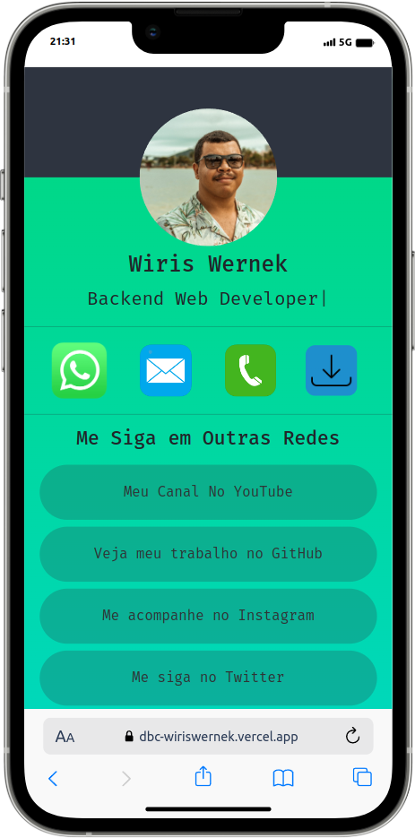
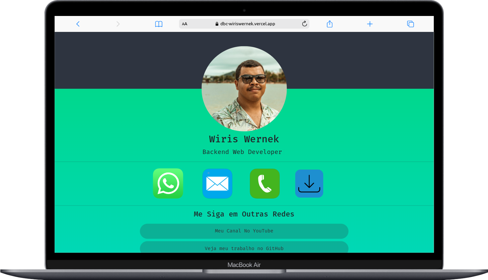
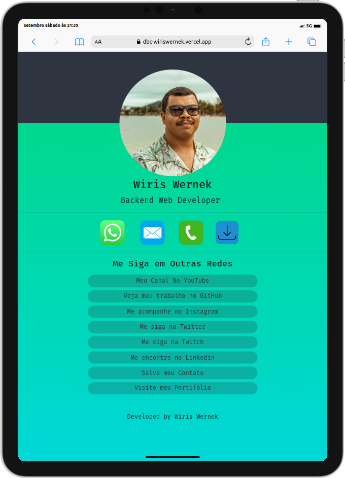

# Digital Visit Card 

## Sobre

A ideia do projeto é ser uma pagina simples e de fácil navegação que possa ser acessada principalmente por smartphones, e que traga as principais informações de uma pessoa, sendo elas desde de dados de contato, currículo ou redes sociais.

Atualmente o projeto se encontra publicado na [Vercel](https://dbc-wiriswernek.vercel.app), e usa como base o Angular com Typescript e Bootstrap 5.

Segue abaixo uma prévia da aplicação.

<h2 align="center">Preview Mobile</h2>

	
	

<h2 align="center">Preview Desktop</h2>

	

<h2 align="center">Preview Tablet</h2>

	

## Como executar esta aplicação?

Para rodar a aplicação voce deve:
- Primeiro clonar este repositório
- Navegar para a pasta ` digital-business-card`
- Executar o comando `npm i` para instalar as dependências do projeto
- Executar o comando `ng s` ou `ng serve` para rodar a aplicação
- Abrir em seu navegador de preferência a URL `http://localhost:4200/` para acessar a aplicação
- Se desejar pode executar diretamente `ng s -o` ou `ng serve --open` para executar a aplicação e abrir automaticamente o navegador já na pagina da aplicação

Por ser uma aplicação focada em mobile para uma melhor experiência é recomendado que você utilize o modo de design responsivo(No Chrome e Firefox pode ser acessado com as teclas `CTRL` + `SHIFT`+ `M`) e trocar para o display de um dos modelos de smartphones que seu navegador disponibilizar. 

Também é possível utilizar a extensão [Mobile Simulator](https://chrome.google.com/webstore/detail/mobile-simulator-responsi/ckejmhbmlajgoklhgbapkiccekfoccmk) disponível para Google Chrome e Firefox.

## Versões dos recursos da aplicação
- angular/cli 
- typescript 
- bootstrap 
